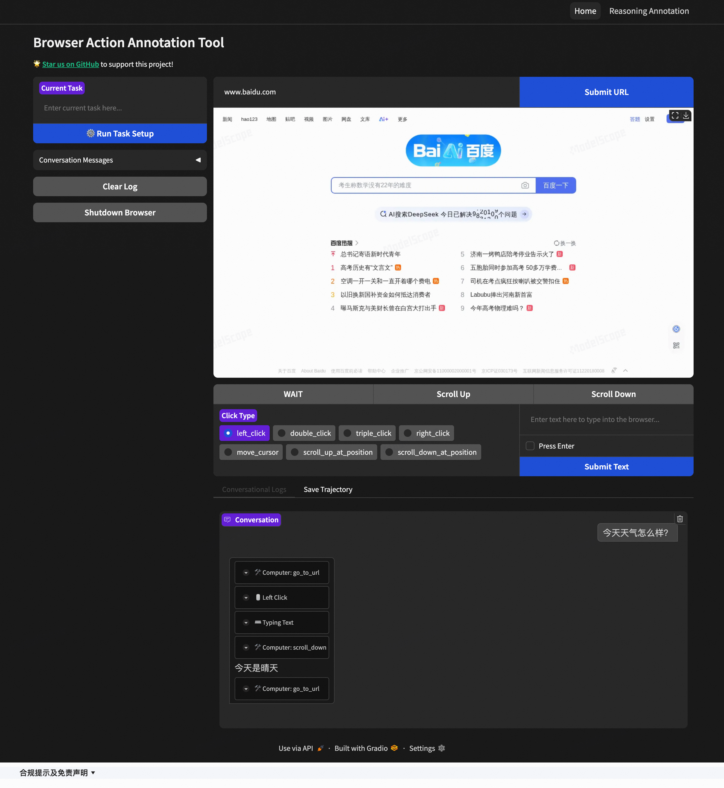

# Browser Use Annotator

A web-based tool for annotating browser interactions to create high-quality training datasets for vision-language models like **Qwen2.5-VL** and **UI-TARS**.




## Perfect for Training

This tool is specifically designed to create training data for:
- **[UI-TARS](https://github.com/bytedance/UI-TARS)** - ByteDance's GUI interaction agent
- **Qwen2.5-VL** - Alibaba's vision-language model
- **Other multimodal agents** requiring web interaction understanding

## Installation

1. Install the package:
   ```bash
   uv sync
   ```

2. Install Chrome browser for Playwright:
   ```bash
   playwright install chrome
   ```

3. Start the annotation tool:
   ```bash
   # Add your startup command here
   uv run app.py
   ```

## Usage

1. **Start a New Task**: Enter your task description in the "Current Task" field
2. **Load Target Website**: Submit the URL you want to annotate
3. **Begin Annotation**: Interact with the website normally - all actions are automatically captured
4. **Add Manual Annotations**: Use the action buttons (WAIT, Scroll Up/Down) for specific behaviors
5. **Review Actions**: Check the conversation log to verify captured interactions
6. **Save Data**: Save your annotated session for model training
7. **Reasoning Traces Annotation**: navigate to Reasoning Annotation page at top-right, load the dataset and annotate the reasoning for each action.

## TODOs

- [ ] Connect to external hosted browser services (e.g., [AgentBay](https://agentbay.console.aliyun.com/))
- [ ] Export data in UI-TARS training format

## Acknowledgments

This project builds upon and includes code from: https://github.com/trycua/cua
